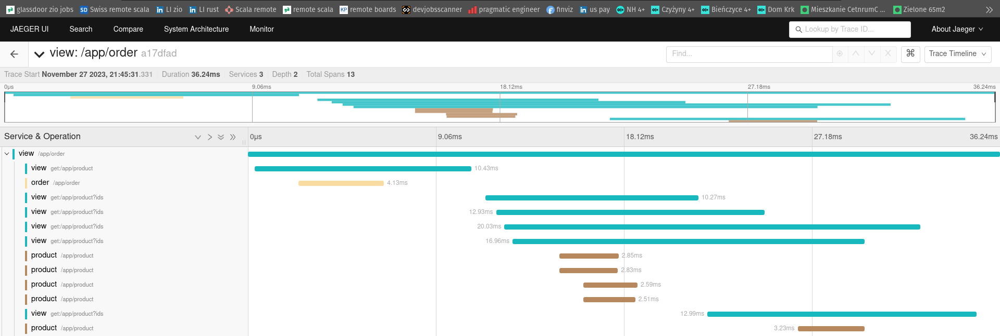
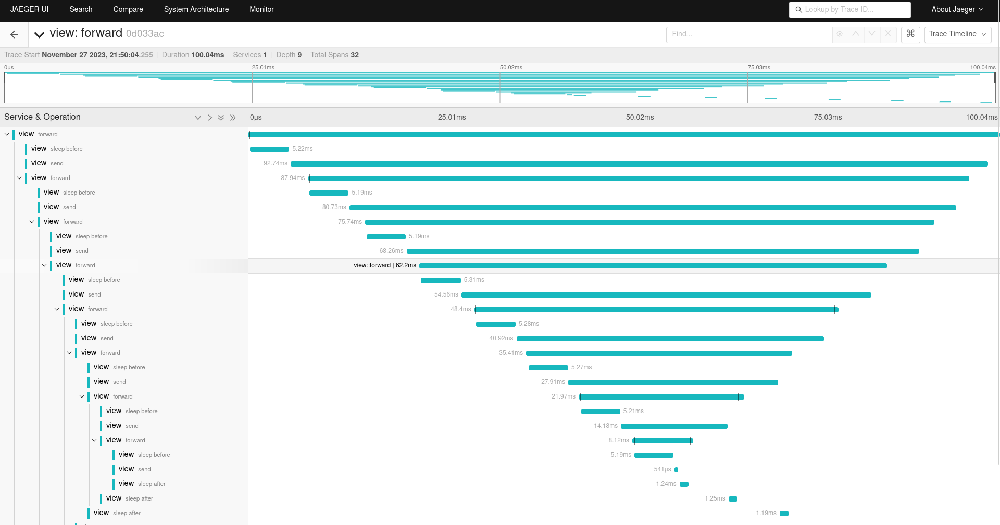

# Observability demo apps

Application used to demonstrate distributed tracing with OpenTelemetry with some metrics with prometheus.  
For simplicity each application specific code is placed inside module with common code in `common` module.  
Also for simplicity each app uses the same postgres db (however different tables inside, normally that should be separate db).

## Tracing
This app uses `zio-opentelmetry` to send spans using newest `OpenTelemetry` standard.

## Apps variants

Variants are chosen via `VERSION` env variable.

- `Product`
  - Version `1` - `3`
- `Order`
  - Version `1` - `2`
- `View`
  - Version `1` - `3`

You can set `VERSION` to `"1"`, `"2"` or `"3"` and observe different behavior.  
`Product` and `Order` return enriched data with increasing version number.  
`View` fetches products for given order in a more optimized way (which can be observed in tracing backend).

## Running

The most straightforward way to run locally is through docker-compose. You don't need to bother with build tool (sbt in this case).  
Go to the run-local directory first
```
cd run-local
```

### Start
Inside that directory run:
```
docker compose up -d
```

### Generate traces
Initial load
```
curl localhost:9500/app/init-load -XPOST -v
```
Get orders
```
curl -s localhost:9500/app/order
```
If you have `jq` installed use it to pretty-print json
```
curl -s localhost:9500/app/order | jq
```

Next go to `localhost:16686` in your browser to play with jaeger ui and find your traces!  
You can change `docker-compose/yaml` to run different versions (change `VERSION` env) and get different results.  
Different versions add more fieds to json (`product`, `order`) or optimize the way you query products (`view`).  
  
Check the results returned and visit jaeger ui again to spot the difference!
The initial (`VERSION` = 1) `workshop-view` should give you sth similar:



### Other endpoints

The app exposes other endpoints you can play with, for example `/common/forward`. You can use it in the following way:
```
curl -XPOST -s localhost:9500/common/forward -d '{"ttl": 7, "beforeMillis": 5, "afterMillis": 1}' | jq
```
It's configured to send requests to itself, introducing intentional delays before and after. Each request decrements `ttl` by 1. Max initial `ttl` is 10.  
After running the `/common/forward` request you should expect sth similar to below screenshot:  



### Stop
To remove everything (even postgres volume):
```
docker compose down -v
```