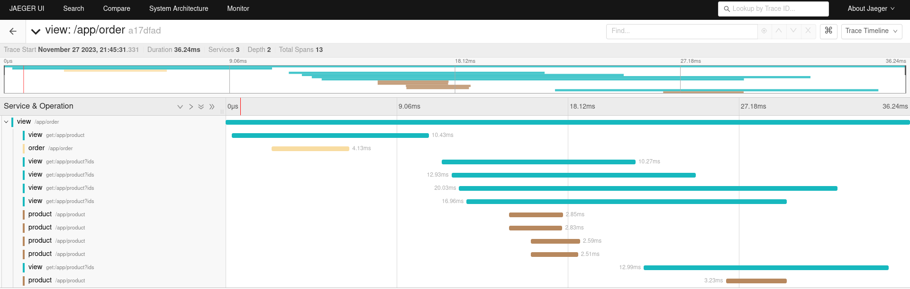
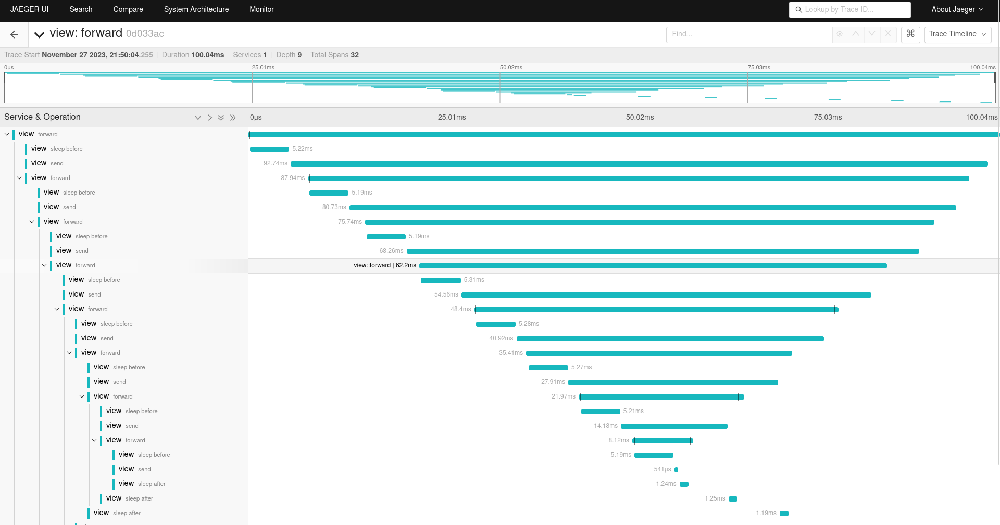
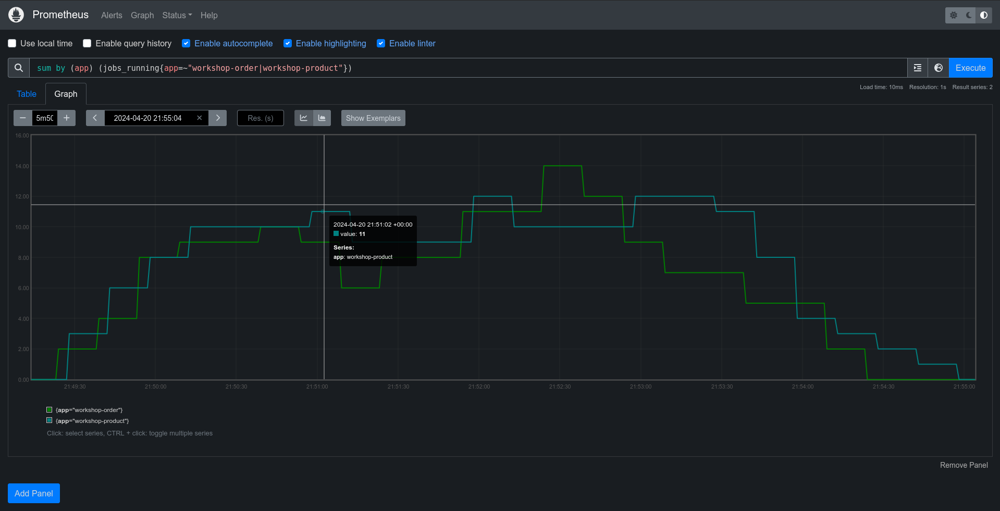
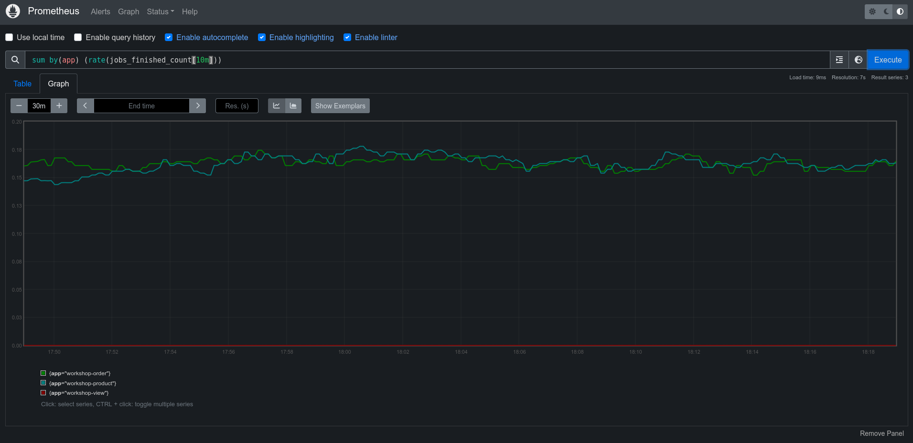

# Observability demo apps

Application used to demonstrate distributed tracing with OpenTelemetry with some metrics with prometheus.  
For simplicity each application specific code is placed inside module with common code in `common` module.  
Also for simplicity each app uses the same postgres db (however different tables inside, normally that should be separate db).

## If you come here from Scala world

Then below you may be interested in the following:
- the entire codebase is written in `Scala 3` and `ZIO 2`,
- app exposes metrics for `Prometheus` server,
- and send traces using open telemetry standard to `Jaeger`,
- actually there are 3 apps there - however all of quite similar
  - module `common` - common functionalities
  - other modules (`product`, `order`, `view`) represent 3 apps

## Tracing
This app uses `zio-opentelmetry` to send spans using newest `OpenTelemetry` standard.

## Apps

```shell

                           +---------+      +------------+
                           |         |      |            |
                           |  Order  |------|  Postgres  |
                           |         |      |            |
                           +---------+      +------------+
           +--------+         |   
           |        |---------+    
           |  View  |              
           |        |---------+    
           +--------+         |    
                           +-----------+    +------------+
                           |           |    |            |
                           |  Product  |----|  Postgres  |
                           |           |    |            |
                           +-----------+    +------------+
 
```

#### Product
  - manages products
  - product name + fun facts

#### Order
  - Order date + product ids (only) + order remarks

#### View
  - combine order and products together to produce full order view
  - also responsible for initial load with random data

## Variants

Variants are chosen via `VERSION` env variable.

- `Product`
  - Version `1` - `3`
- `Order`
  - Version `1` - `2`
- `View`
  - Version `1` - `3`

You can set `VERSION` to `"1"`, `"2"` or `"3"` and observe different behavior.  
`Product` and `Order` return enriched data with increasing version number.  
`View` fetches products for given order in a more optimized way (which can be observed in tracing backend).

## Running

The most straightforward way to run locally is through docker-compose. You don't need to bother with build tool (sbt in this case).  
Go to the run-local directory first
```
cd run-local
```

### Start
Inside that directory run:
```
docker compose up -d
```

You'll run 1 replicas of `workshop apps` + `postgres` + `jaeger` + `prometheus server`

### Generate traces
Initial load
```
curl localhost:9500/app/init-load -XPOST -v
```
Get orders
```
curl -s localhost:9500/app/order
```
If you have `jq` installed use it to pretty-print json
```
curl -s localhost:9500/app/order | jq
```

#### Sample response

```json
{
  "variant": {
    "version": 3,
    "namespace": ""
  },
  "value": [
    {
      "id": 1,
      "variant": {
        "version": 2,
        "namespace": ""
      },
      "products": [
        {
          "variant": {
            "version": 3,
            "namespace": ""
          },
          "value": {
            "id": 4,
            "name": "Cabbage",
            "funFact": "Cabbage is 91% water.",
            "additionalFunFact": "Cabbage can come in green, purple, and white varieties."
          }
        },
        {
          "variant": {
            "version": 3,
            "namespace": ""
          },
          "value": {
            "id": 8,
            "name": "Artichoke",
            "funFact": "Artichokes are flowers that are eaten before they bloom.",
            "additionalFunFact": "Artichokes are one of the oldest cultivated vegetables."
          }
        }
      ],
      "remarks": "Ready for a tasty experience!",
      "date": "2023-11-25T06:57:11.270Z"
    },
    ...
```

Next go to `localhost:16686` in your browser to play with jaeger ui and find your traces!  
You can change `docker-compose.yaml` to run different versions (change `VERSION` env) and get different results.  
Different versions add more fields to json (`product`, `order`) or optimize the way you query products (`view`).  
  
Check the results returned and visit jaeger ui again to spot the difference!
The initial (`VERSION` = 1) `workshop-view` should give you sth similar:



### Recursive requests

The app exposes other endpoints you can play with, for example `/common/forward`. You can use it in the following way:
```
curl -XPOST -s localhost:9500/common/forward -d '{"ttl": 7, "beforeMillis": 5, "afterMillis": 1}' | jq
```
It's configured to send requests to itself, introducing intentional delays before and after. Each request decrements `ttl` by 1. Max initial `ttl` is 10.  
After running the `/common/forward` request you should expect sth similar to below screenshot:  



### Generate metrics

Workshop-view has built-in generator for `async-jobs` - sent to the other 2 apps. The sole purpose of that is to start fake job for 30-120s and finish with either success or failure.
To start generating the jobs, you simply run:

```shell
curl -s -XPUT localhost:9500/generator
```

To check if it's started properly:
```
curl -s -XGET localhost:9500/generator | jq
```

#### Prometheus

To look at sample metrics, go to `localhost:9090` and in the query explorer type:
```
sum by(app) (jobs_running)
```

Below you can find sample queries and visualized graphs




### Stop
To remove everything (even postgres volume):
```
docker compose down -v
```

## Other endpoints

The app has a bunch of other endpoints I use sometimes to demonstrate healthchecks / tracing / monitoring features.  
Look at source code for more details.
